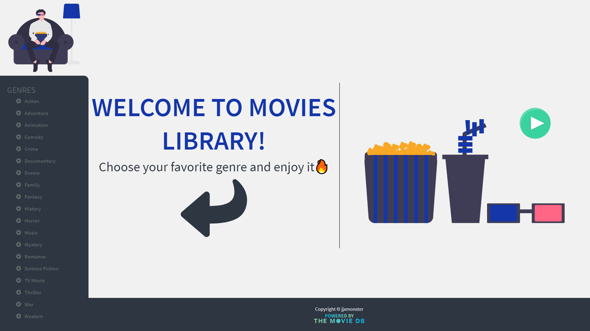
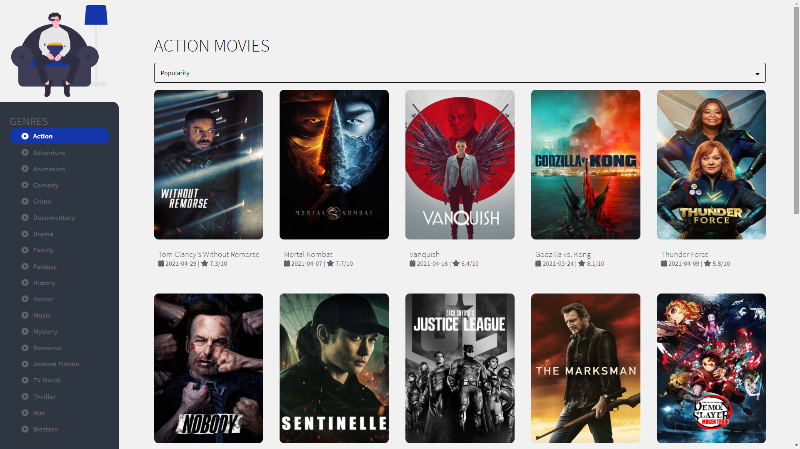
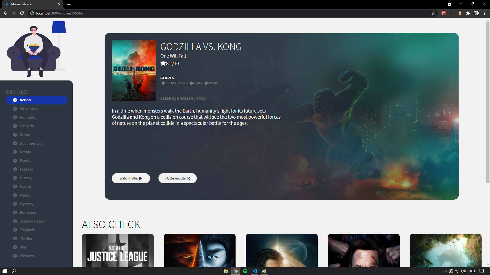
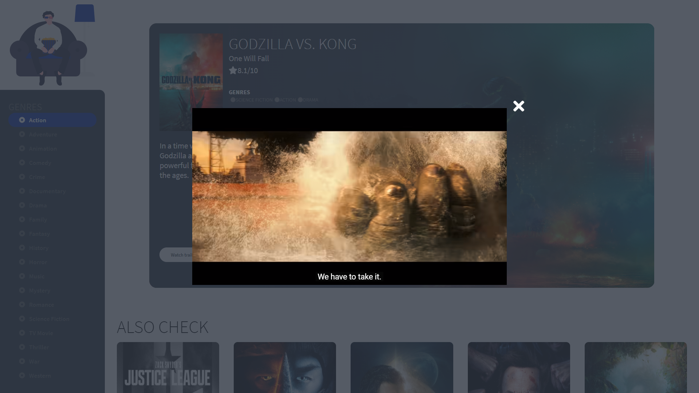

## CHECK IT ONLINE!

https://movie-library-react.herokuapp.com/home

<p align="center">
  <h3 align="center">Movie Library</h3>

  <p align="center">
    A Movie Library made with React using The Movie Database API
    <br />
  </p>
</p>

## About The Project


<br>

<br>

<br>


<p align="center">
User can choose his favourite movie genre and see movies matching to that. After click to some movie, user will able to see more information about it, like description, duration and links to movie website and watch trailer. 
</p>

### Installing

You need to create an API KEY in <a href="https://www.themoviedb.org/documentation/api">The Movie Database API.</a> Create an .env file on the main folder of the project and put your API key

```
REACT_APP_API_KEY=YOUR_API_KEY
```

Clone the Repository and run

```
npm install
npm start
```

### Built With

-  React
-  React-Query
-  Redux
-  Styled Components
-  GSAP

Design inspired by <a href='https://github.com/fidalgodev'>Fidalgo</a>
